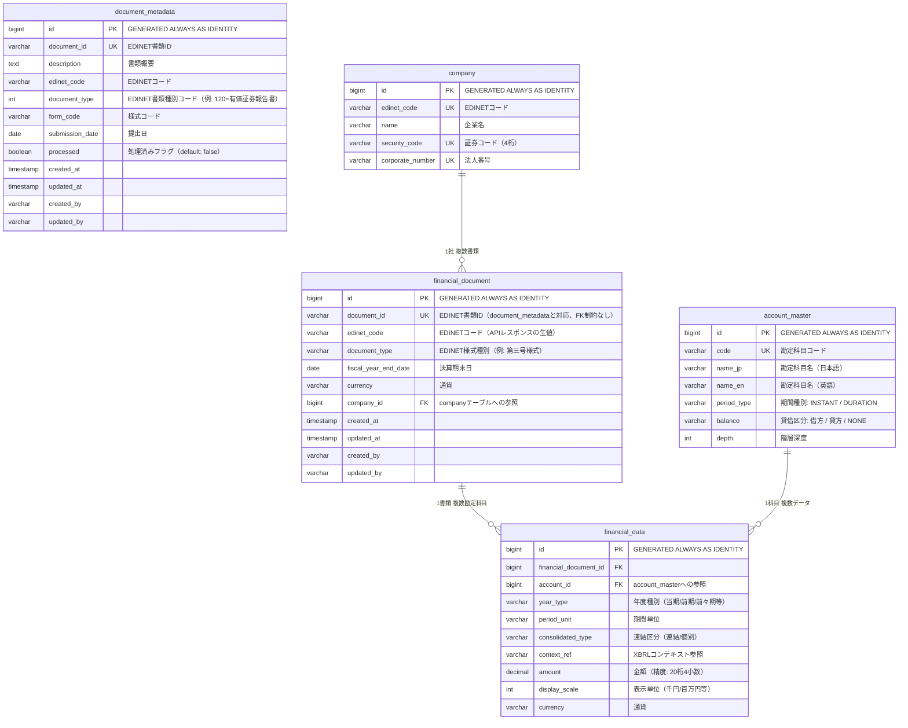
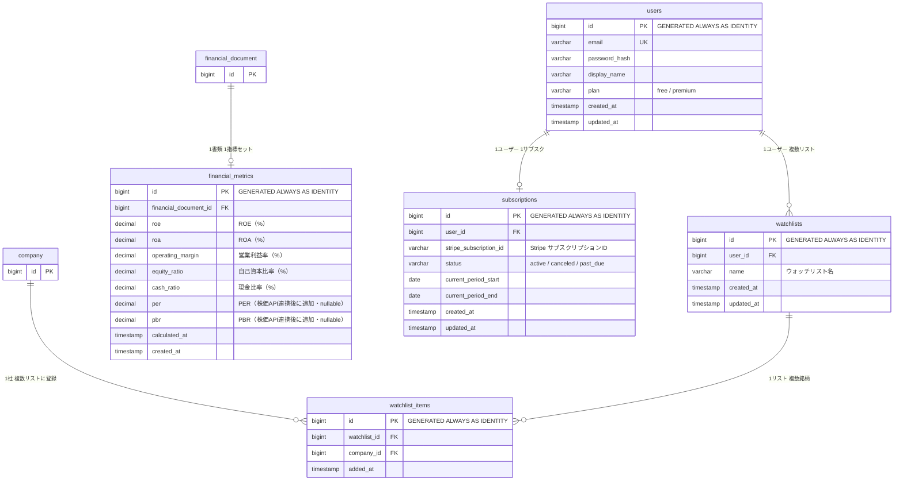

# ER図

最終更新: 2026-03-22（FlywayのSQLをベースに再作成）
Claude Code 作成

---

## テーブル一覧

### Phase 1（実装済み・実装予定）

| テーブル名 | 説明 |
|---|---|
| document_metadata | EDINET書類一覧APIの取得結果 |
| company | 企業マスタ |
| account_master | 勘定科目マスタ（EDINET 勘定科目リスト.xlsx準拠） |
| financial_document | 有価証券報告書メタ情報（EDINET書類取得APIの結果） |
| financial_data | 財務数値データ（1勘定科目1レコード） |

### Phase 2（スクリーニング・認証導入時に追加）

| テーブル名 | 説明 |
|---|---|
| financial_metrics | 計算済み財務指標（スクリーニング用キャッシュ） |
| users | ユーザー |
| subscriptions | サブスクリプション情報 |
| watchlists | ウォッチリスト |
| watchlist_items | ウォッチリスト内の銘柄 |

---

## Mermaid ER図

### Phase 1

### Phase 2

---

## 補足説明

### document_metadata と financial_document の関係
- `document_metadata`：EDINET書類一覧API（日付指定）で取得したレコードを保存
- `financial_document`：EDINET書類取得APIで取得した有価証券報告書の情報を保存
- 両テーブルは `document_id` で対応するが、**FK制約なし**
  - 理由：書類一覧APIはEDINETコード指定不可（日付のみ）のため、手動でEDINETコードを指定して書類取得APIを直接叩くケースがある。その場合 `document_metadata` にレコードが存在しない

### financial_data の consolidated_type
- 有価証券報告書には連結・個別両方の数値が含まれるため、どちらのデータかを区別する
- 財務指標の計算時は連結を優先する

### financial_metrics（Phase 2）
- Phase 1では `financial_data` から都度計算してレスポンスする
- Phase 2のスクリーニング導入時に追加。指標をキャッシュしてWHERE条件での高速絞り込みを可能にする
- 指標追加時のオペレーション：カラム追加（Flyway） → 全レコードバッチ再計算

### インデックス方針
**Phase 1**
- `document_metadata.document_id`（UNIQUE）
- `company.edinet_code`（UNIQUE）
- `company.security_code`（UNIQUE）
- `financial_document.document_id`（UNIQUE）
- `financial_document.company_id`
- `financial_data.financial_document_id`
- `financial_data.account_id`

**Phase 2（スクリーニング用）**
- `financial_metrics.cash_ratio`
- `financial_metrics.roe`、`roa`、`equity_ratio`
